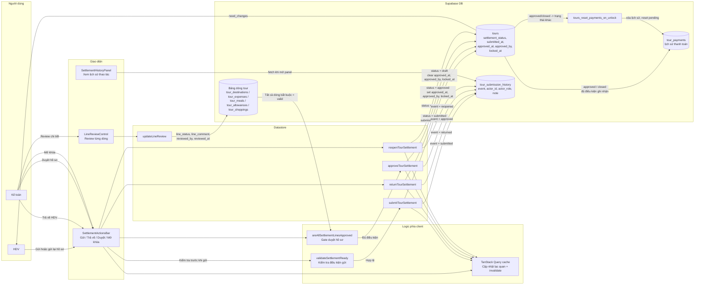

# Luồng quyết toán tour

Cập nhật: 2026-06-16

Tài liệu này mô tả luồng quyết toán tour giữa HDV và kế toán. Quyết toán gồm trạng thái cấp tour, review từng dòng chi phí và lịch sử thao tác.

## Mục đích

Luồng quyết toán giúp HDV gửi hồ sơ tour cho kế toán, kế toán kiểm tra từng dòng, trả về nếu cần bổ sung, hoặc duyệt để khóa hồ sơ. Sau khi duyệt, tour mới đủ điều kiện ghi nhận thanh toán cho HDV.

## Sơ đồ data workflow

## Trạng thái hồ sơ

`tours.settlement_status` có các giá trị:

- `draft`: đang soạn, HDV có thể sửa và gửi.
- `submitted`: đã gửi kế toán, chờ review.
- `need_changes`: kế toán trả về, HDV cần bổ sung và gửi lại.
- `approved`: đã duyệt, hồ sơ bị khóa.
- `closed`: trạng thái đóng/lưu trữ, cũng được coi là đã khóa và đủ điều kiện thanh toán.

Trong code hiện tại, các action chính là gửi, trả về, duyệt và mở khóa. `closed` là trạng thái hợp lệ trong schema và helper, nhưng module settlement hiện tại không có hàm riêng để chuyển sang `closed`.

## Các file chính

- `src/components/tours/SettlementActionsBar.tsx`: nút gửi kế toán, trả về HDV, duyệt, mở khóa, xem lịch sử.
- `src/components/tours/SettlementHistoryPanel.tsx`: hiện lịch sử gửi/trả/duyệt/mở khóa.
- `src/components/tours/LineReviewControl.tsx`: popover review từng dòng.
- `src/lib/settlement-utils.ts`: label trạng thái, điều kiện gửi/review, validate trước khi gửi.
- `src/lib/tour-line-utils.ts`: danh sách dòng cần review và điều kiện tất cả đã duyệt.
- `src/lib/datastore/modules/tour-operations/tour-settlement.ts`: các hàm thao tác settlement trên DB.
- `supabase/migrations/20260520000000_add_tour_settlement_workflow.sql`: cột workflow, cột review từng dòng và bảng lịch sử.

## Điều kiện gửi kế toán

Nút gửi hiện khi:

- user có quyền `submit_settlement`;
- `settlementStatus` là `draft` hoặc `need_changes`.

Trước khi gửi, `validateSettlementReady(tour)` kiểm tra:

- có mã tour;
- có công ty;
- có HDV;
- có ngày bắt đầu và ngày kết thúc;
- tổng khách lớn hơn 0;
- có quốc tịch khách;
- nếu dùng nhiều quốc tịch, tổng pax theo quốc tịch phải bằng tổng khách;
- các dòng điểm tham quan, chi phí, ăn uống, phụ cấp, mua sắm không được thiếu tên;
- `summary.totalTabs` phải lớn hơn 0.

Nếu validation lỗi, UI hiện toast "Chưa đủ điều kiện gửi" kèm danh sách lỗi.

## Luồng gửi hồ sơ

1. HDV bấm "Gửi kế toán" hoặc "Gửi lại kế toán".
2. UI cho nhập ghi chú tùy chọn.
3. UI cập nhật cache lạc quan sang `submitted`.
4. Datastore gọi `store.submitTourSettlement(tour.id, note)`.
5. DB đọc `settlement_status` và `submission_count` hiện tại.
6. Nếu tour đã `approved` hoặc `closed`, hàm ném lỗi và không gửi lại.
7. DB update `tours`:
   - `settlement_status = submitted`;
   - `submitted_at = now`;
   - `submission_count = submission_count + 1`.
8. DB lấy user hiện tại và role/settlement_role trong `user_profiles`.
9. DB insert `tour_submission_history` với event `submitted`, actor, actor role và note.
10. UI invalidate cache tour, aggregate query và pending count.

## Review từng dòng

Kế toán review từng dòng trong màn hình tổng hợp. Các trạng thái dòng:

- `unchecked`: chưa kiểm tra.
- `valid`: hợp lệ.
- `need_more`: cần bổ sung.
- `invalid`: không hợp lệ.

Khi kế toán lưu review:

1. `LineReviewControl` gọi hook review dòng.
2. Datastore gọi `store.updateLineReview(tourId, lineType, lineId, review)`.
3. `lineType` được map sang bảng:
   - `destination` -> `tour_destinations`;
   - `expense` -> `tour_expenses`;
   - `meal` -> `tour_meals`;
   - `allowance` -> `tour_allowances`;
   - `shopping` -> `tour_shoppings`.
4. DB update dòng con theo `id` và `tour_id`:
   - `line_status`;
   - `line_comment`;
   - `reviewed_by`;
   - `reviewed_at`.

Lưu ý: helper khóa nút duyệt `areAllSettlementLinesApproved` chỉ yêu cầu các dòng trong `destinations`, `expenses`, `meals`, `allowances` đều là `valid`. Datastore vẫn hỗ trợ review `shopping`, nhưng gate duyệt hiện tại không đưa shopping vào điều kiện bắt buộc.

## Luồng trả về HDV

1. Kế toán bấm "Trả về HDV" khi tour đang `submitted`.
2. UI cho nhập ghi chú lý do.
3. UI cập nhật cache lạc quan sang `need_changes`.
4. Datastore gọi `store.returnTourSettlement(tour.id, note)`.
5. DB chỉ cho trả về nếu trạng thái hiện tại là `submitted`.
6. DB update `tours.settlement_status = need_changes`.
7. DB insert `tour_submission_history` với event `returned`.
8. HDV thấy hồ sơ ở trạng thái "Cần bổ sung", sửa dữ liệu và gửi lại.

## Luồng duyệt hồ sơ

1. Kế toán có quyền `approve_settlement` mở tour đang `submitted`.
2. Nút "Duyệt" chỉ bật khi `areAllSettlementLinesApproved(tour)` trả về `true`.
3. Nếu còn dòng chưa `valid`, UI hiện lỗi "Chỉ chốt khi tất cả dòng đã được duyệt".
4. UI cập nhật cache lạc quan sang `approved`.
5. Datastore gọi `store.approveTourSettlement(tour.id, note)`.
6. DB chỉ cho duyệt nếu trạng thái hiện tại là `submitted`.
7. DB update `tours`:
   - `settlement_status = approved`;
   - `approved_at = now`;
   - `approved_by = actorId`;
   - `locked_at = now`.
8. DB insert `tour_submission_history` với event `approved`.
9. UI hiện thông báo hồ sơ đã duyệt và đã khóa.
10. Từ lúc này, helper `isTourLocked` coi tour là khóa và helper thanh toán coi tour đủ điều kiện ghi nhận thanh toán.

## Luồng mở khóa

1. User có quyền `reopen_settlement` thấy nút "Mở khóa" khi tour đang `approved` hoặc `closed`.
2. UI cho nhập ghi chú tùy chọn.
3. UI cập nhật cache lạc quan sang `draft`.
4. Datastore gọi `store.reopenTourSettlement(tour.id, note)`.
5. DB update `tours`:
   - `settlement_status = draft`;
   - `approved_at = null`;
   - `approved_by = null`;
   - `locked_at = null`.
6. DB insert `tour_submission_history` với event `reopened`.
7. Trigger `tours_reset_payments_on_unlock` xóa lịch sử `tour_payments` nếu tour chuyển từ `approved`/`closed` về trạng thái khác.

Mở khóa đồng nghĩa hồ sơ có thể thay đổi lại, nên thanh toán tour đã ghi nhận trước đó không còn được giữ.

## Lịch sử quyết toán

`tour_submission_history` là event log cho các thao tác:

- `submitted`: gửi kế toán.
- `returned`: trả về HDV.
- `approved`: duyệt hồ sơ.
- `reopened`: mở khóa hồ sơ.

Mỗi record lưu:

- `tour_id`;
- `event`;
- `actor_id`;
- `actor_role`;
- `note`;
- `created_at`.

`SettlementHistoryPanel` chỉ fetch lịch sử khi panel được mở, sắp xếp mới nhất trước.

## Quyền và RLS

UI dùng các quyền:

- `submit_settlement`: gửi hồ sơ.
- `review_settlement_line`: review từng dòng.
- `approve_settlement`: trả về hoặc duyệt hồ sơ.
- `reopen_settlement`: mở khóa hồ sơ đã duyệt/đóng.
- `mark_tour_paid`: xem/thao tác liên quan thanh toán sau khi duyệt.

RLS hardening dùng các helper:

- `can_view_tour(tour_id)`: admin, chủ tour, hoặc user có các quyền review/approve/reopen/payment khi tour không còn `draft`.
- `can_modify_tour(tour_id)`: admin, chủ tour, hoặc user có quyền review/approve/reopen.
- `tour_submission_history` chỉ cho select/insert khi user được xem/sửa tour theo các helper trên.

## Mối liên hệ với thanh toán

- Thanh toán tour chỉ được ghi sau khi hồ sơ quyết toán là `approved` hoặc `closed`.
- Duyệt hồ sơ set `locked_at`, giúp UI coi dữ liệu tour đã khóa.
- Mở khóa hồ sơ sẽ xóa `tour_payments`, đưa trạng thái thanh toán về `pending`.
